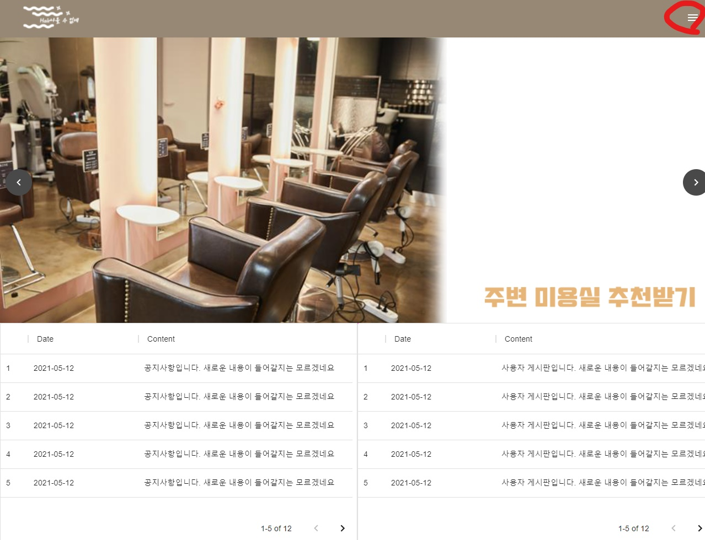
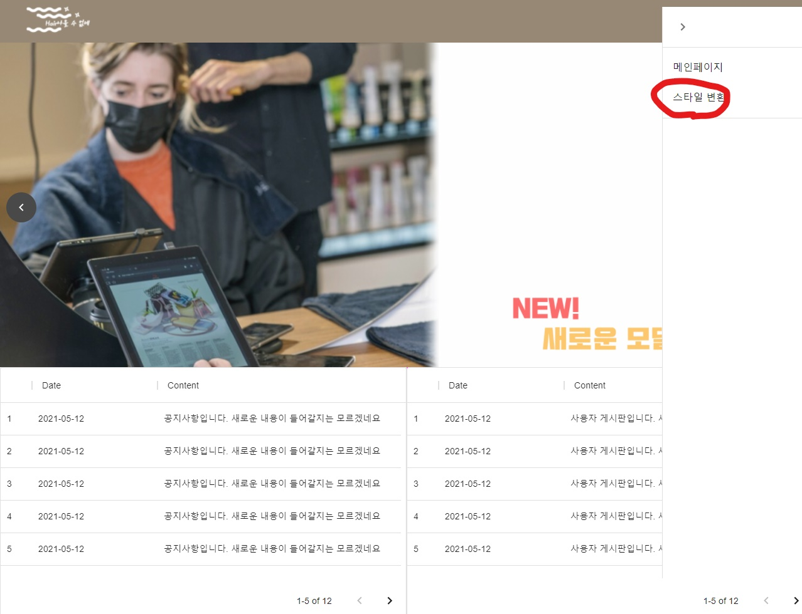
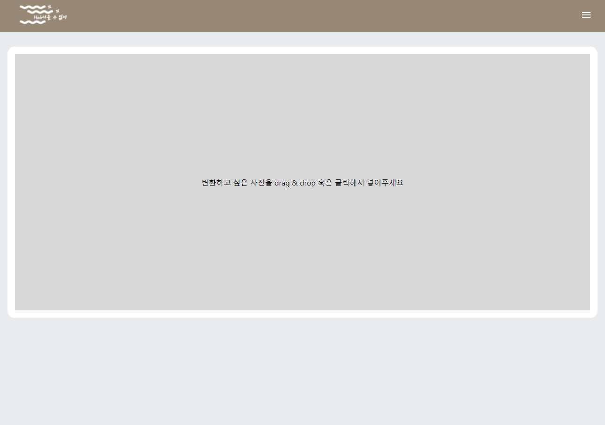
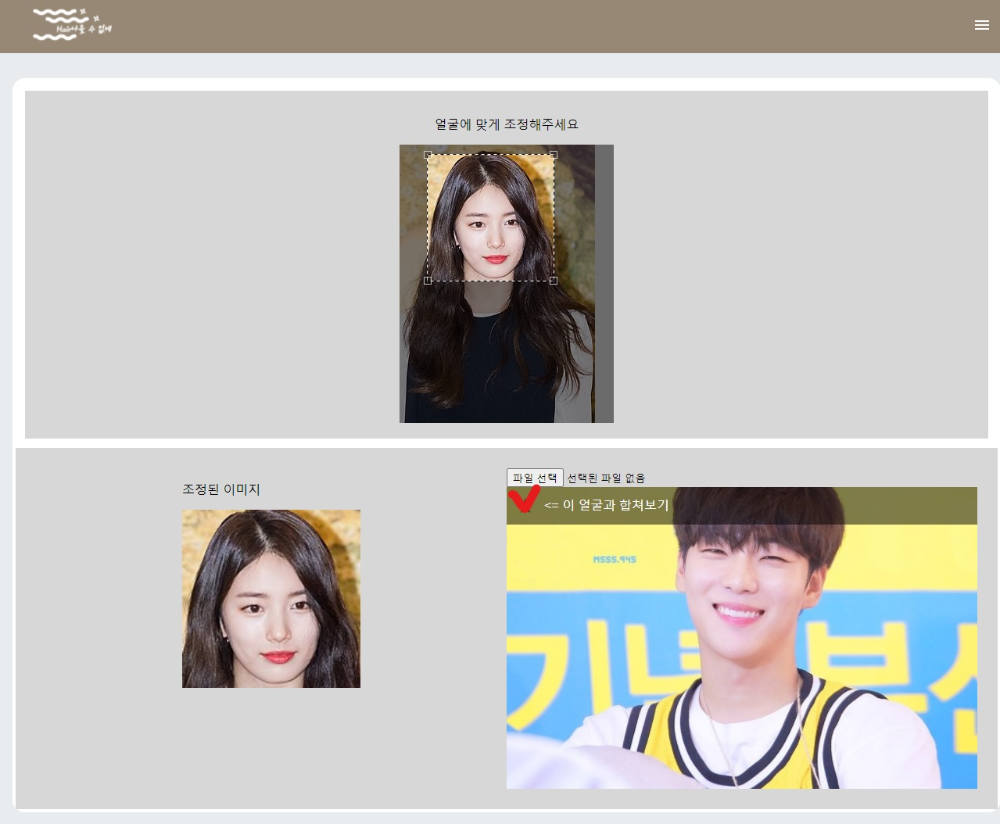
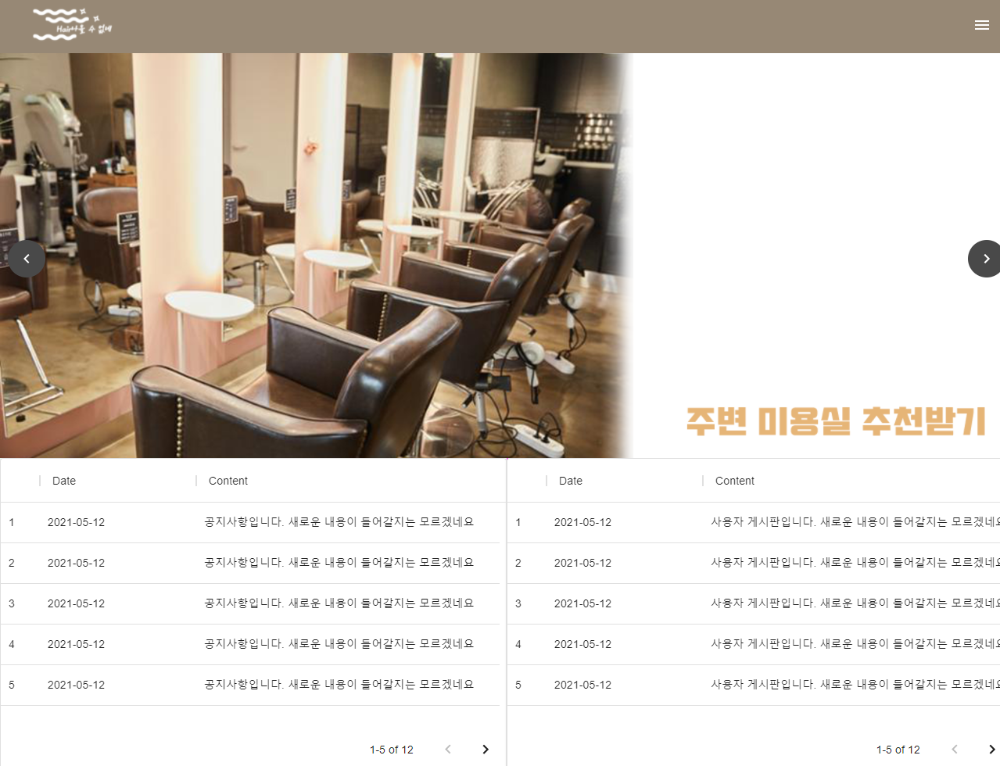
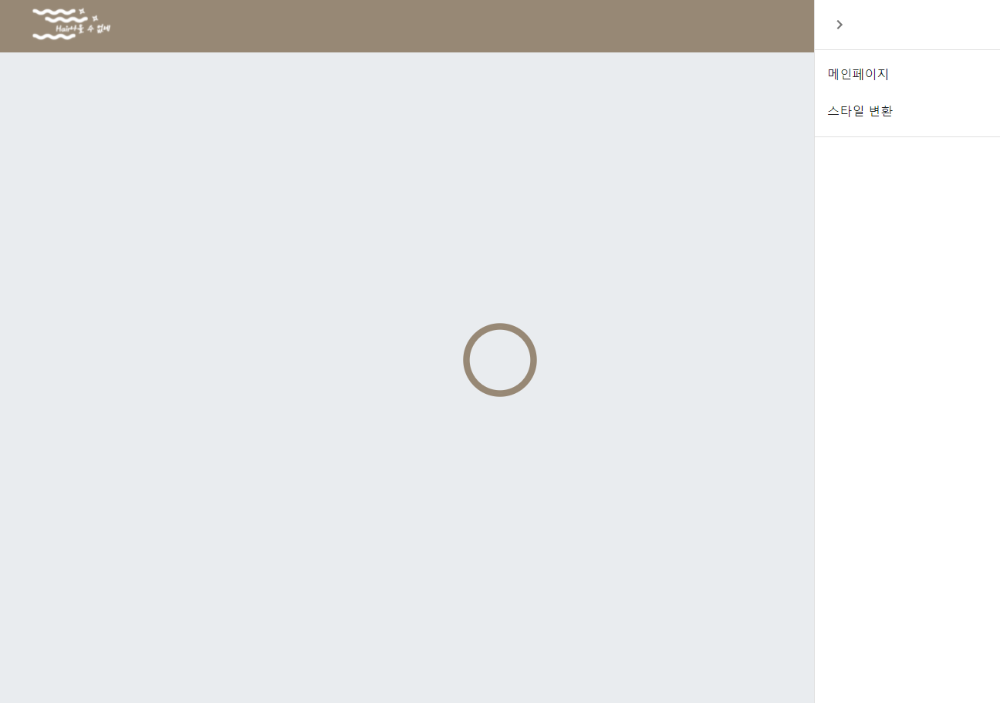

# Espresomdeia 2021년 OJT 프론트 웹 페이지

- 2021년 신입 입사자 팀 프로젝트입니다.

- 사용 프레임워크 : React

## 사용 예
1. 메뉴 바를 클릭합니다.

2. 스타일 변환을 클릭합니다.

3. 이미지 파일을 Drag & Drop 혹은 클릭하여 업로드합니다.

4. 얼굴을 알맞게 Crop하여 아래 조정된 이미지에 얼굴이 들어오게 합니다.

5. 자신의 얼굴을 합성하고 싶은 모델을 예시에서 고르거나 새로운 이미지 파일을 업로드하고 ☆를 클릭

6. 완료!

## 구현 기능
   - 메인페이지 Carousel

   - 이미지 업로드 후 원하는 형태로 Crop하는 기능

   - Drag & Drop file upload

   - 자신이 알아보고 싶은 스타일 이미지 업로드 기능
   - axios를 통한 POST 통신
   - 로딩 페이지 구현

---
## Component 설명
---
# App.js
  - 하위 Component List
    1. MainContainer
  - State 설명
    - open : boolean의 상태를 지님
      - Drawer 기능을 사용하기 위한 상태.
      - 사용 예 :
         ```JSX
         <Drawer className={classes.drawer} variant="persistent" anchor="right"
               open={open}
               classes={{
                  paper: classes.drawerPaper,
               }}>
               <div className={classes.drawerHeader}>
                  <IconButton onClick={handleDrawerClose}>
                     {theme.direction === 'rtl' ? <ChevronLeftIcon /> : <ChevronRightIcon />}
                  </IconButton>
               </div>
               <Divider>
                  <List>
                     {['메인페이지', '스타일 변환'].map((text, index) => (
                     <ListItem button key={text} onClick={() => pageChange(index)}>
                        <ListItemText primary={text} />
                     </ListItem>
                     ))}
                  </List>
               <Divider />
         </Drawer>
         ``` 
# MainContainer.js
   -  하위 Component List
        1. MainCarousel
        2. CropImage
   - State 설명
     - model : boolean의 상태를 지님
       - 스타일 변환 과정이 모두 성공적으로 완료되면 True
       - 사용 예 :
         ```JSX
         if (model){
               return <>
               <Grid container>
               <Grid item xs={12} sm={6}></Grid>
               <Grid item xs={12} sm={6}>
                  </img>
               </Grid>
               </Grid>
               <Snackbar anchorOrigin={{ vertical, horizontal }} open={open} autoHideDuration={10000} onClose={handleClose}>
               <Alert onClose={handleClose} severity={event}>
                  This is a success message!
               </Alert>
               </Snackbar></>
         }
         ```
     - imgLink : String의 상태를 지님
       - 스타일 변환 과정이 모두 성공적으로 완료되었을때 이미지의 base64 문자열을 리턴
       - 사용 예 :
         ```JSX
         </img>
         ```
      - loading : boolean의 상태를 지님
        - 스타일 변환 과정 중 axios로 post요청 중 loading 상태를 결정하는 state
        - 사용 예 :
            ```JSX
               if(loading){
                  return <LoadingTemplateBlock>
                        <Loader
                        type="Puff"
                        color="#978875"
                        height={100}
                        width={100} 
                     />
                  </LoadingTemplateBlock>
                  
            ```
      - snackOpen : boolean의 상태를 지님
        - 스타일 변환 과정에서 성공 혹은 에러 상태를 나타내기 위한 'SnackBar' 사용을 위한 State. 하위 컴포넌트인 CropImage.js에서 사용
        - 사용 예 : 
            ```JSX
                  const {open, vertical, horizontal} = snackOpen;
            ```
      -  event: String의 상태를 지님
         -  SnackBar 사용시 필요한 State. Success, error, Alert 등의 상태를 가지고 있음.
         -  사용 예 :
            ```JSX
            <Snackbar anchorOrigin={{ vertical, horizontal }} open={open} autoHideDuration={10000} onClose={handleClose}>
               <Alert onClose={handleClose} severity={event}>
                  {snackMsg}
               </Alert>
            </Snackbar>
            ```
      - snackMsg : String의 상태를 지님
        - SnackBar에 들어가는 메세지의 상태. 주로 백엔드 서버에서 리턴하는 메세지를 저장. 하위 컴포넌트인 CropImage.js에서 사용
        - 사용 예 :
            ```JSX
            <Snackbar anchorOrigin={{ vertical, horizontal }} open={open} autoHideDuration={10000} onClose={handleClose}>
               <Alert onClose={handleClose} severity={event}>
                  {snackMsg}
               </Alert>
            </Snackbar>
            ```
# CropImage.js
   - State 설명
     - upImg 


사용 패키지 : react-material-ui-carousel
    - 패키지 다운로드 방법(npm, yarn)
      - npm install react-material-ui-carousel --save
      - yarn add react-material-ui-carousel
    - 선행 다운로드 패키지
      - @material-ui/core
      - @material-ui/icons